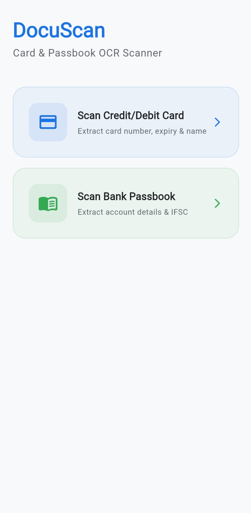
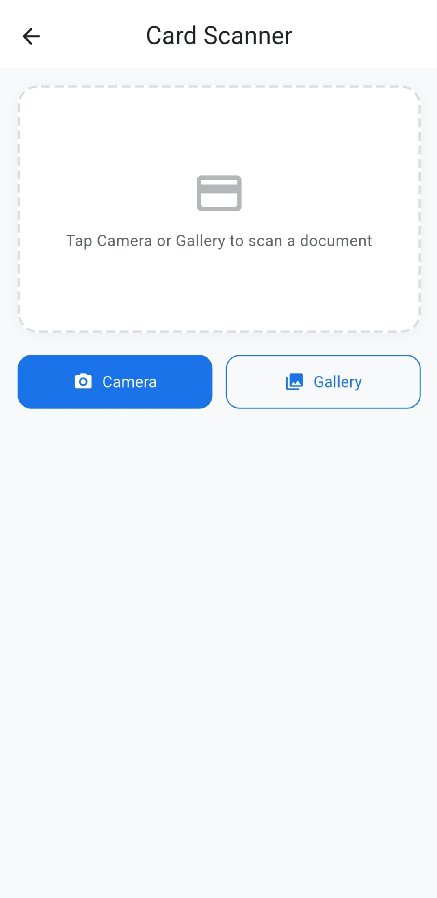
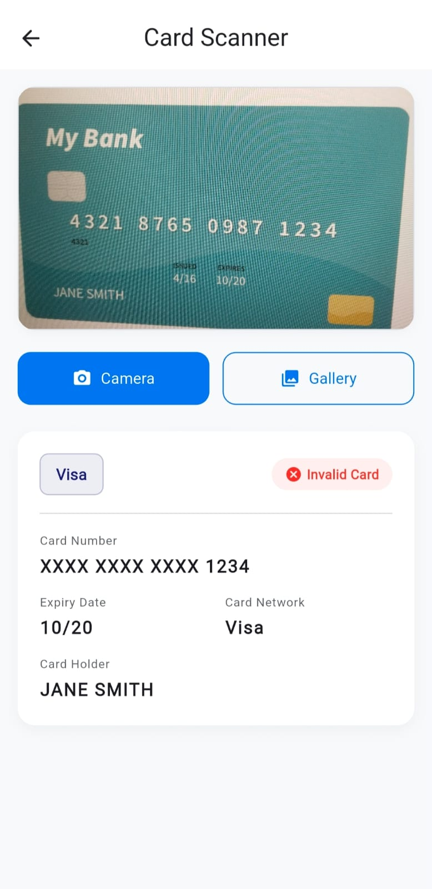
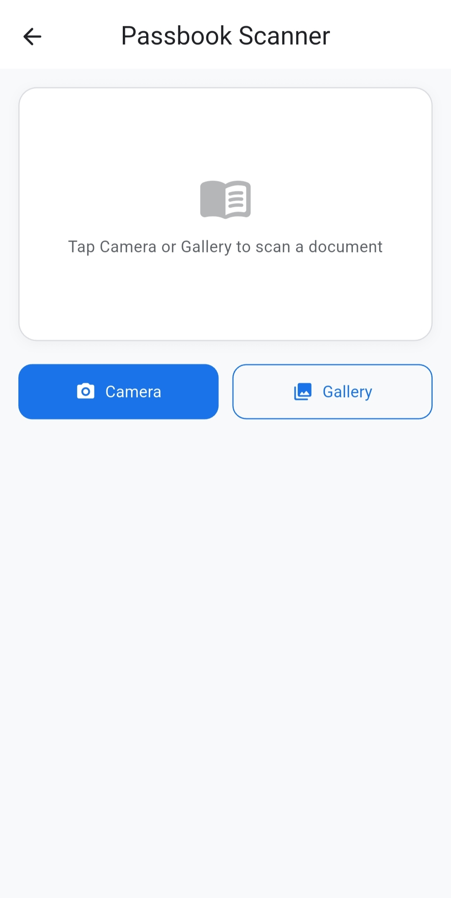
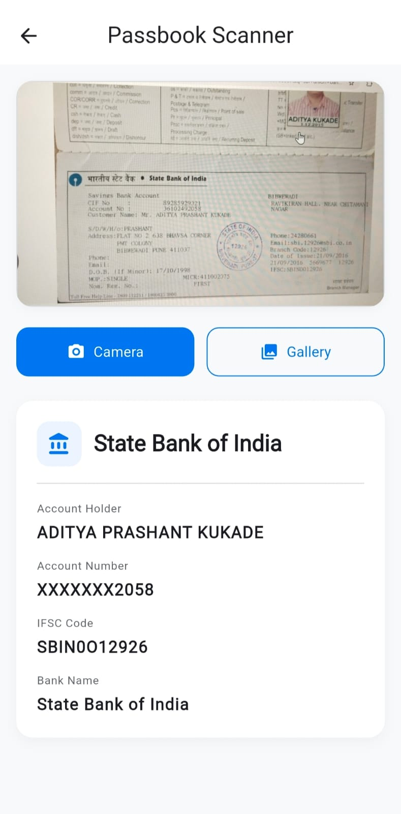

# DocuScan — Card & Passbook OCR Scanner

## 📋 Overview

DocuScan is a Flutter mobile application that uses Google ML Kit's text recognition to scan and extract information from credit/debit cards and bank passbooks. All parsing logic is implemented manually in pure Dart — no third-party card or bank parsing libraries are used.

## 🚀 Setup & Run

### Prerequisites
- Flutter 3.x (tested with 3.38.6)
- Android Studio / VS Code
- Android device or emulator (API 21+)

### Steps
1. Clone the repo
   ```bash
   git clone https://github.com/anj2609/DocuScan.git
   cd DocuScan
   ```
2. Install dependencies
   ```bash
   flutter pub get
   ```
3. Run the app
   ```bash
   flutter run
   ```

### ML Kit Notes
- Google ML Kit text recognition is bundled automatically via the `google_mlkit_text_recognition` plugin.
- On first run, the ML model may download in the background (~10 MB).
- `minSdkVersion` is set to 21 for ML Kit compatibility.

## 📦 Libraries Used

| Library | Version | Purpose |
|---|---|---|
| `google_mlkit_text_recognition` | ^0.13.0 | On-device OCR text extraction |
| `camera` | ^0.11.0 | Live camera feed (future use) |
| `image_picker` | ^1.1.0 | Capture/select images for scanning |
| `permission_handler` | ^11.3.0 | Runtime camera & storage permissions |
| `path_provider` | ^2.1.0 | Access to device temp file paths |
| `flutter_riverpod` | ^2.5.0 | State management |

## 🧠 Parsing Logic Explained

### Card Parser (`card_parser.dart`)
1. **Number extraction**: Finds all 13–19 digit sequences (possibly separated by spaces, dashes, or dots) using regex. Each candidate is validated with the Luhn algorithm; the first passing candidate is selected.
2. **Network detection**: Determines Visa, Mastercard, Amex, RuPay, or Discover based on IIN (Issuer Identification Number) prefix ranges.
3. **Expiry extraction**: Matches `MM/YY`, `MM/YYYY`, `MM-YY`, `MM-YYYY`, and standalone `MMYY` patterns. Validates that the month is 01–12 and the year is not in the past.
4. **Name extraction**: Finds lines that are entirely upper-case, 2–4 words, letters-only, and excludes known card keywords (VALID, THRU, VISA, etc.).

### Passbook Parser (`passbook_parser.dart`)
1. **IFSC extraction**: Matches the standard IFSC format (`[A-Z]{4}0[A-Z0-9]{6}`). Bank name is derived from a hardcoded prefix-to-name map.
2. **Account number extraction**: Uses a label-first strategy — searches for keywords like "Account No", "A/C No", etc., and extracts the adjacent number. Falls back to longest digit sequence (9–18 digits), excluding phone numbers and IFSC-embedded digits.
3. **Name extraction**: Looks for labelled names first ("Name:", "Account Holder:"), then falls back to ALL-CAPS heuristics.

### OCR Cleaner (`ocr_cleaner.dart`)
Performs context-aware character substitution (O→0, l→1, etc.) only within digit-heavy tokens to avoid corrupting names and other alphabetic text.

### Luhn Algorithm (`luhn_validator.dart`)
Full implementation of the modulus-10 checksum algorithm. Strips non-digit characters, doubles every second digit from the right, subtracts 9 if > 9, and validates that the total is divisible by 10.

## ⚠️ Assumptions Made

- Card numbers are always 13–19 digits (covers all major networks).
- Cardholder names on cards are printed in ALL CAPS.
- Passbook account numbers are typically 9–18 digits, and the exact length is validated against the bank derived from the IFSC code.
- IFSC codes always follow the standard `[A-Z]{4}0[A-Z0-9]{6}` format (with fallback OCR correction for 'BIND' -> 'BKID', etc).
- 10-digit numbers starting with 6–9 are treated as phone numbers, and numbers starting with 1800 are treated as customer care numbers; both are excluded from account candidates.
- Mixed-script (non-ASCII) lines in passbooks are skipped during parsing.
- Expiry dates from recently expired cards (e.g. up to year 50) are successfully extracted.

## 🚧 What Was Skipped & Why

- **iOS not tested** — Built on Windows; iOS-specific configurations not verified.
- **Live camera preview** — Uses `image_picker` (capture then scan) instead of real-time camera feed for reliability.
- **NFC/chip reading** — Out of scope; OCR only.
- **Server-side IFSC validation** — Uses a local hardcoded map of ~20 major banks; not exhaustive.
- **Dark mode** — Not implemented; single light theme for MVP.
- **Clipboard copy** — Not implemented; results displayed only.

## 🧪 Running Tests

```bash
flutter test
```

**Test suites:**
- `test/luhn_test.dart` — 9 test cases for Luhn algorithm validation
- `test/card_parser_test.dart` — 12 test cases for card parsing (Visa, Amex, MC, separators, OCR noise, expiry, names)
- `test/passbook_parser_test.dart` — 8 test cases for passbook parsing (IFSC, accounts, masking, phone exclusion)

All 29 tests pass.

## 📁 Project Structure

```
lib/
├── main.dart                         # Entry point with ProviderScope
├── app.dart                          # MaterialApp root
├── home_screen.dart                  # Home with scanner cards
├── core/
│   ├── constants/app_strings.dart    # All string literals
│   ├── theme/app_theme.dart          # Material 3 theme
│   └── utils/
│       ├── luhn_validator.dart       # Luhn algorithm
│       └── ocr_cleaner.dart          # OCR text pre-processing
├── features/
│   ├── card_scanner/                 # Card scanning feature
│   │   ├── data/card_parser.dart
│   │   ├── domain/models/card_details.dart
│   │   └── presentation/
│   └── passbook_scanner/             # Passbook scanning feature
│       ├── data/passbook_parser.dart
│       ├── domain/models/bank_details.dart
│       └── presentation/
└── shared/
    ├── services/ocr_service.dart     # ML Kit wrapper
    └── widgets/                      # Reusable UI components
```

## 📱 Screenshots

| Main Screen | Card Scanner | Card Example | Passbook Scanner | Passbook Example |
| :---: | :---: | :---: | :---: | :---: |
|  |  |  |  |  |
